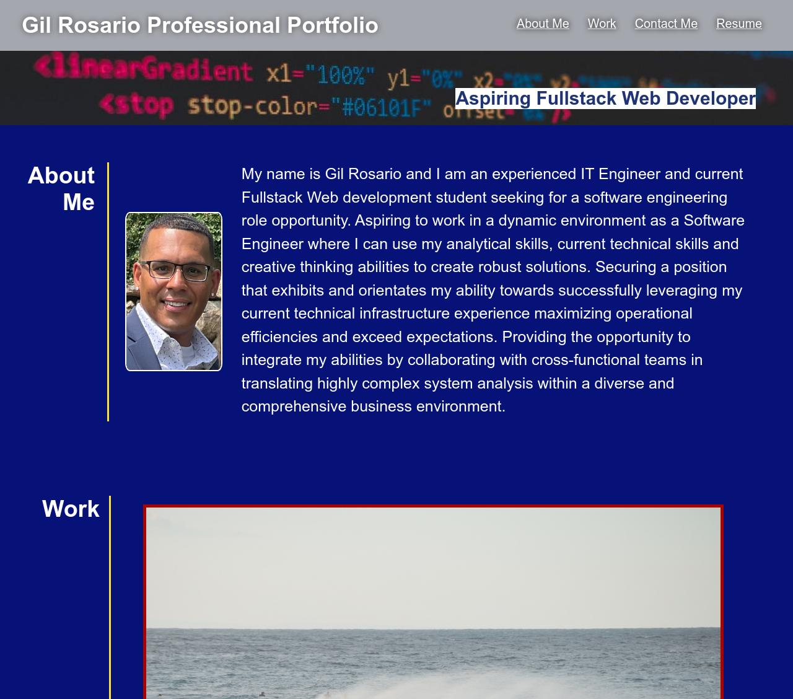

# Gil-Rosario-Professional-Site
## Description

This site was developer to represent a portfolio of work that showcases my skills and talents in web development. It is meant to spark interests from employers whom are looking to fill open software development/engineering roles within their organizations. This portfolio highlights my web development work as well as the thought processes (depicted in this README) behind it. 

What was completed:

- Developed responsive layout that adapts anyone's viewport
- Attempted semantic structure HTML & CSS code formatting
- Used functional links to redirect viewers to pages containing information about me like my development projects, previous work experience (resume), and contact info.
- Added href links to title headers to allow UI to jump to that section.
- Used Pseudo elements and classes to make the site more appealing.

## Installation

This site was deployed using github pages. 
The following github documentation link was used to follow steps on deploying github pages: 

https://docs.github.com/en/pages/getting-started-with-github-pages/creating-a-github-pages-site

## Usage

You can find code repo [here.](https://github.com/grosario1/gil-rosario-professional-site) \
Link to deployed live URL [here.](https://grosario1.github.io/gil-rosario-professional-site/)

## Credits

N/A

## License

Please refer to the LICENSE in the repo.
